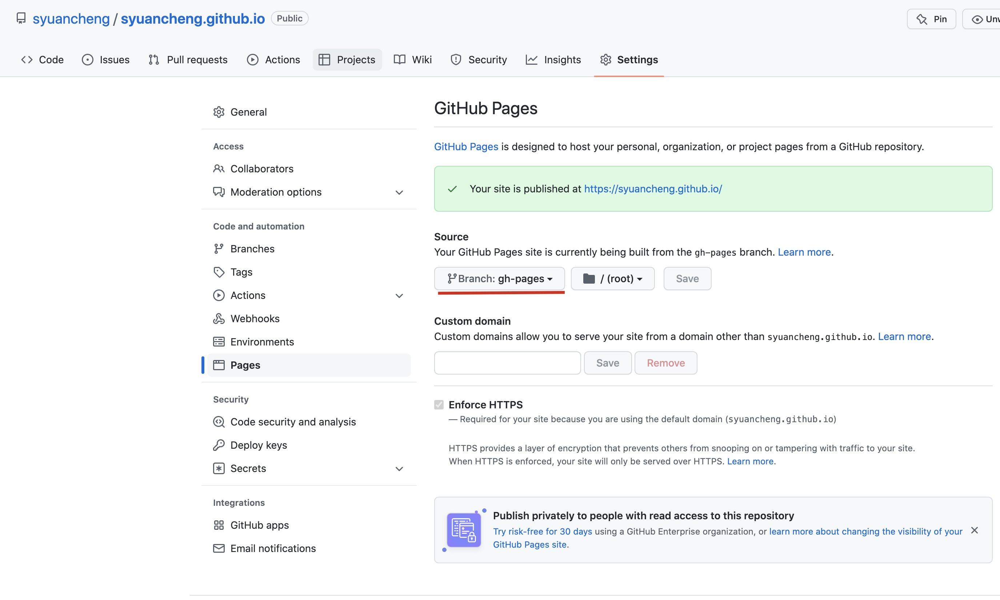
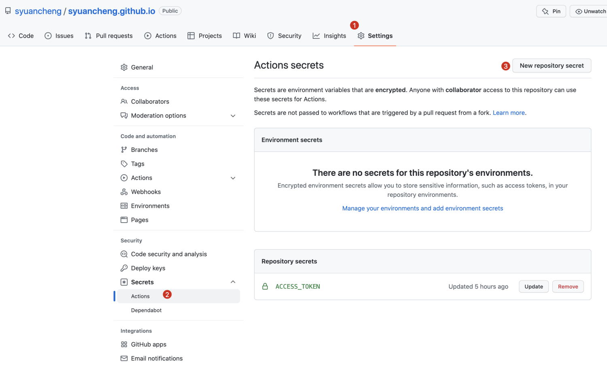
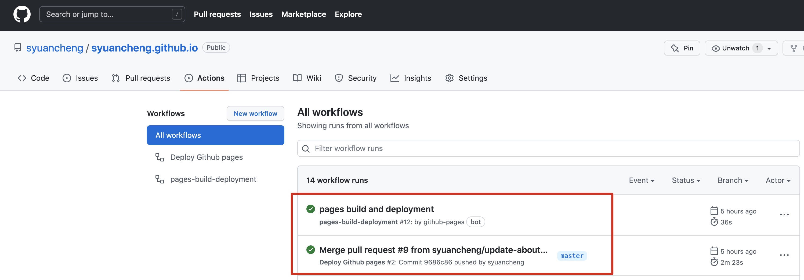

[Docusaurus](https://docusaurus.io/docs) will help you ship a **beautiful documentation** site in no time.
Building a custom tech stack is expensive. Instead, focus on your content and just write Markdown files.

## Create a new Docusaurus site
Install [Node.js](https://nodejs.org/en/download/) and create a new Docusaurus site:
```cmd
npx create-docusaurus@latest my-website classic
```
Start the site:
```cmd
cd my-website
npx docusaurus start
```
Open [http://localhost:3000](http://localhost:3000/) and follow the tutorial.

## Project Structure
Assuming you chose the classic template and named your site my-website, you will see the following files generated under a new directory my-website/:
```bigquery
my-website
├── blog
│   ├── 2019-05-28-hola.md
│   ├── 2019-05-29-hello-world.md
│   └── 2020-05-30-welcome.md
├── docs
│   ├── doc1.md
│   ├── doc2.md
│   ├── doc3.md
│   └── mdx.md
├── src
│   ├── css
│   │   └── custom.css
│   └── pages
│       ├── styles.module.css
│       └── index.js
├── static
│   └── img
├── docusaurus.config.js
├── package.json
├── README.md
├── sidebars.js
└── yarn.lock
```
### Project structure rundown

- /blog/ - Contains the blog Markdown files. You can delete the directory if you've disabled the blog plugin, or you can change its name after setting the path option. More details can be found in the [blog guide](https://docusaurus.io/docs/blog)
- /docs/ - Contains the Markdown files for the docs. Customize the order of the docs sidebar in sidebars.js. You can delete the directory if you've disabled the docs plugin, or you can change its name after setting the path option. More details can be found in the [docs guide](https://docusaurus.io/docs/docs-introduction)
- /src/ - Non-documentation files like pages or custom React components. You don't have to strictly put your non-documentation files here, but putting them under a centralized directory makes it easier to specify in case you need to do some sort of linting/processing
  - /src/pages - Any JSX/TSX/MDX file within this directory will be converted into a website page. More details can be found in the [pages guide](https://docusaurus.io/docs/creating-pages)
- /static/ - Static directory. Any contents inside here will be copied into the root of the final build directory
- /docusaurus.config.js - A config file containing the site configuration. This is the equivalent of siteConfig.js in Docusaurus v1
- /package.json - A Docusaurus website is a React app. You can install and use any npm packages you like in them
- /sidebars.js - Used by the documentation to specify the order of documents in the sidebar


## Deployment
### 1. change config file
We have known that **docusaurus.config.js** is a config file that containing the site configuration, so we can change some values of the fields which is about what is shown in home page. apart from this, we have to change the following four attributes, this is very important for deploy.
```text
url: 'https://syuancheng.github.io',
baseUrl: '/',
organizationName: 'syuancheng',
projectName: 'syuancheng.github.io',
```

### 2. config in github
create a new branch **gh-pages**


### 3. set auto-deploy by github action
create a [.github/workflows/documentation.yml](https://github.com/yingwinwin/yingwinwin.github.io/blob/master/.github/workflows/documentation.yml) file in root folder. refer to [github action hand bool by Ruan Yifeng](http://www.ruanyifeng.com/blog/2019/09/getting-started-with-github-actions.html)
```yaml
name: Deploy Github pages
on:
  push:
    branches:
      - master
jobs:
  build-and-deploy:
    runs-on: ubuntu-latest
    steps:
    - name: Checkout
      uses: actions/checkout@master
      with:
        persist-credentials: false
    - name: Install and Build
      run: |
        npm install
        npm run-script build
    - name: Deploy
      uses: JamesIves/github-pages-deploy-action@releases/v3
      with:
        ACCESS_TOKEN: ${{ secrets.ACCESS_TOKEN }}
        BRANCH: gh-pages
        FOLDER: build
        BUILD_SCRIPT: npm install && npm run build
```

set **ACCESS_TOKEN** in setting/action


We can check the workflow execution in action of this repo as some change is merged to master branch.



Go to [https://syuancheng.github.io](https://syuancheng.github.io) to check the result.